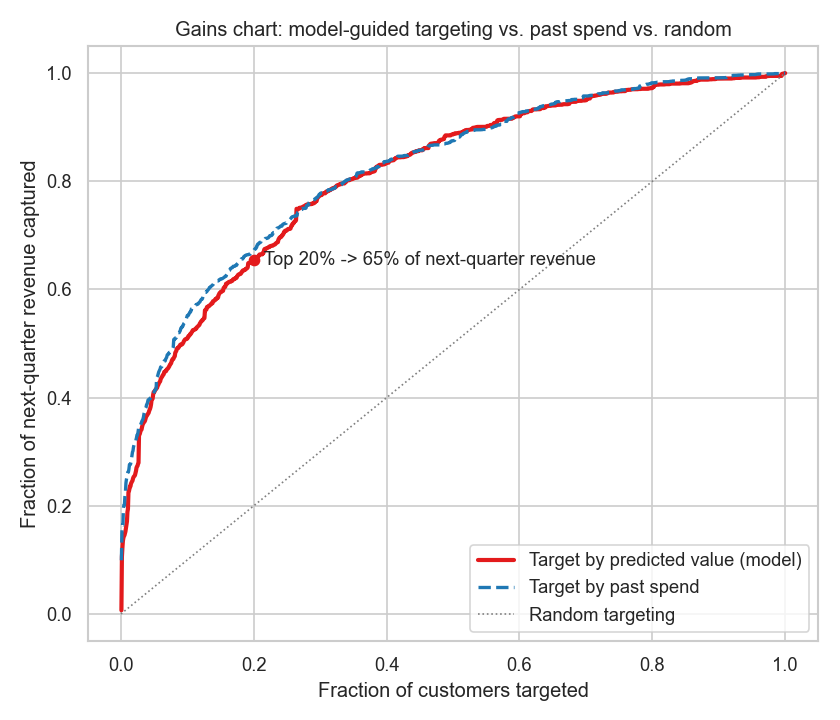

# Customer Lifetime Value & Churn Prediction for Marketing

Using **SQL + Python** to predict which e-commerce customers will buy again next
quarter and how much they will spend, then turning those predictions into
**actionable marketing decisions** and a **measurable revenue impact**.

Built on the real **Online Retail II** dataset: **805,549 transactions** from a UK
online retailer (2009-2011), covering **5,278 customers**.

---

## 💡 Business question

> *Marketing has a limited budget. Which customers should we focus retention and
> promotion spend on to protect the most future revenue?*

To answer it, the model learns from each customer's behaviour **up to a cutoff date**
and predicts their **next-quarter** behaviour and spend.

## 📈 Measurable impact

| Outcome | Result |
|---|---|
| **Repeat-purchase model** (will the customer buy next quarter?) | ROC-AUC **0.79** |
| **Targeting the top 20% of customers by predicted value** | captures **65% of next-quarter revenue**, a **3.3× lift** over untargeted outreach |
| **Value concentration** | the top predicted-value decile spends **~50×** the bottom decile |
| **At-risk revenue surfaced** | **44 high-value customers** worth **£273k** in historic revenue (hold-out sample; ≈ **£1.1M across the full base**) flagged as likely to lapse |

**So what:** marketing can (1) concentrate spend on the ~20% of customers who drive
two-thirds of next-quarter revenue, and (2) act on a **named retention list** of
high-value customers predicted to churn, *before* they leave. That second list is
something a simple "rank by past spend" report cannot produce.

> **Honest note:** for pure revenue-ranking, ranking customers by past spend is a
> very strong baseline (it captures ~67% in the top 20%). The model roughly matches
> it there; its distinct value is the **per-customer churn probability**, which
> enables the at-risk retention targeting above.



---

## 🛠️ How it works

1. **Data engineering in SQL** (`01_build_features.py`, `sql/build_features.sql`), 
   transactions are loaded into a **SQLite** database; SQL builds a customer-level
   feature table (RFM: recency, frequency, monetary; plus tenure, average order
   value, product variety, active months, and recent 90-day spend). The **target**
   is each customer's revenue in the following 91 days.
2. **Modelling in Python** (`02_model_ltv.py`), 
   - a **gradient-boosted classifier** predicts repeat purchase (behaviour);
   - a **gradient-boosted regressor** predicts next-quarter spend (value);
   - the two combine into an **expected-value score** used for targeting.
3. **Business translation**, a gains chart, decile lift, and an at-risk high-value
   customer list.

## 🗂️ Repository structure
```
customer-ltv-prediction/
├── 01_build_features.py     # SQL feature engineering (SQLite)
├── 02_model_ltv.py          # churn + value models, gains chart, at-risk list
├── sql/build_features.sql   # the customer-feature SQL (generated, human-readable)
├── data/customer_features.csv  # engineered customer table (one row per customer)
├── outputs/                 # figures + metrics.json
└── README.md
```

## 🔁 Reproduce it
```bash
pip install pandas numpy scikit-learn scipy matplotlib seaborn openpyxl
# 1) download Online Retail II from UCI (#502) into data/ and unzip, then:
python 01_build_features.py   # builds the SQLite DB + customer feature table
python 02_model_ltv.py        # trains models, writes figures + metrics.json
```
Data: [UCI Online Retail II](https://archive.ics.uci.edu/dataset/502/online+retail+ii).

## 🧰 Tools
**SQL** (SQLite) for feature engineering · **Python** (pandas, scikit-learn, scipy) ·
matplotlib / seaborn

## 👤 Author
**Kingsley Amegah**, Health & Marketing Data Scientist · GitHub: [@Kingsley-amg](https://github.com/Kingsley-amg)
